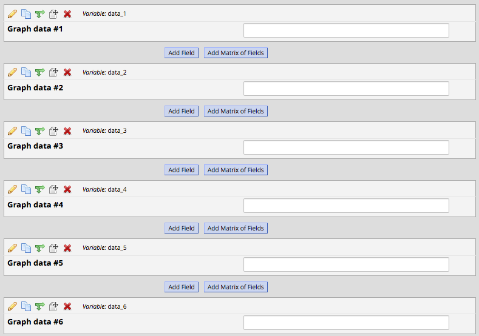
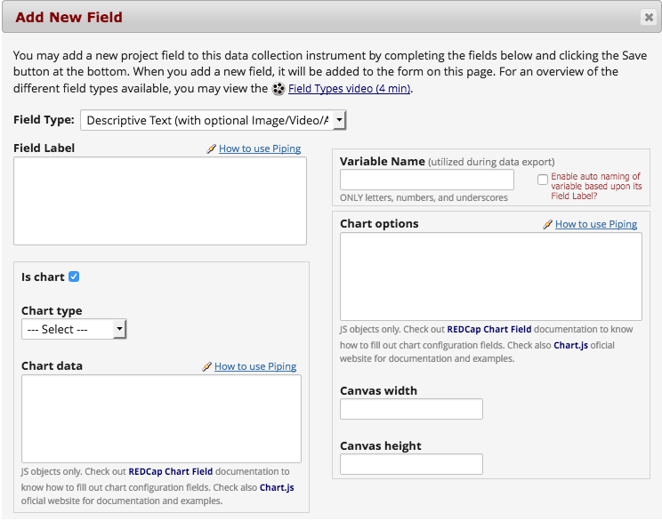

# REDCap Chart Field
Provides a field type for charts by using a library of your choice - [Charts.js](http://www.chartjs.org/) or [Chartist](https://gionkunz.github.io/chartist-js/). Supports [Piping](https://redcap.vanderbilt.edu/redcap_v8.3.2/DataEntry/piping_explanation.php) on field configuration, so it can be used to display facts to survey participants based on their previous answers.

## Prerequisites
- REDCap >= 8.0.3

## Installation
- Clone this repo into `<redcap-root>/modules/redcap_chart_field_v<version_number>`.
- Go to **Control Center > Manage External Modules** and enable REDCap Chart Field.

## Choosing your chart library
Two amazing third-party chart libraries are supported by this module - Chart.js and Chartist.


## Setting up a chart field (Chart.js example)
This section will walk you through a few steps to setup a [Charts.js](http://www.chartjs.org/) chart, dynamically populated via [Piping](https://redcap.vanderbilt.edu/redcap_v8.3.2/DataEntry/piping_explanation.php).

### 1. Setting up source data (for Piping purposes)

The following fields are responsible to populate our chart example. Pay attention at the variable names - they will be referenced later on.



And that's the particular data set we are going to use.


### 2. Creating a chart field
To create a chart field, go throught the usual field creation procedure on Online Designer, this time selecting the new field type provided by this module - Chart.


### 3. Mapping an example provided by the selected third-party library
Once you select the Chart field type, a few extra fields are shown:



To fill these fields out it is very important to get familiar with the documentation provided by the third-party chart library you chose, since the inputs are expected to be Javascript objects that follow a particular structure defined by the library.

Despite this sounds very technical, no development skills are required to manipulate these parameters - for most of cases it's just a matter of copying & pasting a suitable example from documentation - and making slight changes to adapt it to your needs.

Let's create a _bar_ chart by using [the main example from Chart.js official documentation](http://www.chartjs.org/docs/latest/#creating-a-chart) as base.

<details><summary>Click to see the code provided by Chart.js website</summary>

``` html
<canvas id="myChart" width="400" height="400"></canvas>
<script>
var ctx = document.getElementById("myChart").getContext('2d');
var myChart = new Chart(ctx, {
    type: 'bar',
    data: {
        labels: ["Red", "Blue", "Yellow", "Green", "Purple", "Orange"],
        datasets: [{
            label: '# of Votes',
            data: [12, 19, 3, 5, 2, 3],
            backgroundColor: [
                'rgba(255, 99, 132, 0.2)',
                'rgba(54, 162, 235, 0.2)',
                'rgba(255, 206, 86, 0.2)',
                'rgba(75, 192, 192, 0.2)',
                'rgba(153, 102, 255, 0.2)',
                'rgba(255, 159, 64, 0.2)'
            ],
            borderColor: [
                'rgba(255,99,132,1)',
                'rgba(54, 162, 235, 1)',
                'rgba(255, 206, 86, 1)',
                'rgba(75, 192, 192, 1)',
                'rgba(153, 102, 255, 1)',
                'rgba(255, 159, 64, 1)'
            ],
            borderWidth: 1
        }]
    },
    options: {
        scales: {
            yAxes: [{
                ticks: {
                    beginAtZero:true
                }
            }]
        }
    }
});
</script>
```

</details>
&nbsp;

Mapping the code above into REDCap Chart Field properties:

__1. Type:__ Bar
<br>
__2. Data__:

``` javascript
{
    labels: ["Red", "Blue", "Yellow", "Green", "Purple", "Orange"],
    datasets: [{
        label: '# of Votes',
        data: [12, 19, 3, 5, 2, 3],
        backgroundColor: [
            'rgba(255, 99, 132, 0.2)',
            'rgba(54, 162, 235, 0.2)',
            'rgba(255, 206, 86, 0.2)',
            'rgba(75, 192, 192, 0.2)',
            'rgba(153, 102, 255, 0.2)',
            'rgba(255, 159, 64, 0.2)'
        ],
        borderColor: [
            'rgba(255,99,132,1)',
            'rgba(54, 162, 235, 1)',
            'rgba(255, 206, 86, 1)',
            'rgba(75, 192, 192, 1)',
            'rgba(153, 102, 255, 1)',
            'rgba(255, 159, 64, 1)'
        ],
        borderWidth: 1
    }]
}
```

__3. Options:__

``` javascript
{
    scales: {
        yAxes: [{
            ticks: {
                beginAtZero:true
            }
        }]
    }
}
```

__4. Canvas width:__ 400
<br>
__5. Canvas height:__ 400


### 4. Setting up chart properties

Let's finally transfer the mapping into the form:


Note the highlighted area on image above - Piping is being used in order to dynamically populate the chart data (`[data_1]`, `[data_2]`, etc) - so each record entry or survey has its own chart results.

Obs.: as the example above, Piping wildcards must be used between quotes (single or double), e.g. `'[data_1]'`.

### 5. The result
For this particular case - remember the input given on [Chart source data section](#chart-source-data-for-piping-purposes) - we have the following result chart when accessing the field in a survey:


## Analogous example using Chartist
In this section we will go through the analogous example for Chartist library, using the same source data. This time we'll draw a _line_ chart.

The process of mapping a [Chartist example](https://gionkunz.github.io/chartist-js/#responsive-charts-configuration) is quite similar what we've seen in the previous section.

<details><summary>Click to see the code provided by Chartist website</summary>

``` javascript
/* Add a basic data series with six labels and values */
var data = {
  labels: ['1', '2', '3', '4', '5', '6'],
  series: [
    {
      data: [1, 2, 3, 5, 8, 13]
    }
  ]
};

/* Set some base options (settings will override the default settings in Chartist.js *see default settings*). We are adding a basic label interpolation function for the xAxis labels. */
var options = {
  axisX: {
    labelInterpolationFnc: function(value) {
      return 'Calendar Week ' + value;
    }
  }
};

/* Now we can specify multiple responsive settings that will override the base settings based on order and if the media queries match. In this example we are changing the visibility of dots and lines as well as use different label interpolations for space reasons. */
var responsiveOptions = [
  ['screen and (min-width: 641px) and (max-width: 1024px)', {
    showPoint: false,
    axisX: {
      labelInterpolationFnc: function(value) {
        return 'Week ' + value;
      }
    }
  }],
  ['screen and (max-width: 640px)', {
    showLine: false,
    axisX: {
      labelInterpolationFnc: function(value) {
        return 'W' + value;
      }
    }
  }]
];

/* Initialize the chart with the above settings */
new Chartist.Line('#my-chart', data, options, responsiveOptions);
```

</details>
&nbsp;

Again, __you don't need to be a developer__ to manipulate this information - it's just a copy & paste work. That's how the code above is mapped into the form fields:

__1. Type:__ Line
<br>
__2. Data__:

``` javascript
{
  labels: ['1', '2', '3', '4', '5', '6'],
  series: [
    {
      data: [1, 2, 3, 5, 8, 13]
    }
  ]
}
```

__3. Options:__

``` javascript
{
  axisX: {
    labelInterpolationFnc: function(value) {
      return 'Calendar Week ' + value;
    }
  }
}
```

__3. Responsive options:__

``` javascript
[
  ['screen and (min-width: 641px) and (max-width: 1024px)', {
    showPoint: false,
    axisX: {
      labelInterpolationFnc: function(value) {
        return 'Week ' + value;
      }
    }
  }],
  ['screen and (max-width: 640px)', {
    showLine: false,
    axisX: {
      labelInterpolationFnc: function(value) {
        return 'W' + value;
      }
    }
  }]
]
```

Filling out the form:


As we've done on Chart.js section, we are using Piping to make chart data dynamic.

Note that the configuration for Chartist is slightly different - there is no canvas dimensions fields, and "Chart responsive options" field is added. Check the [official Chartist documentation](https://gionkunz.github.io/chartist-js/) to understand how it works.

Obs.: width and height have been manually added to __Chart options__ field to exemplify that is also possible to define chart dimensions with Chartist.

And here is the result!


